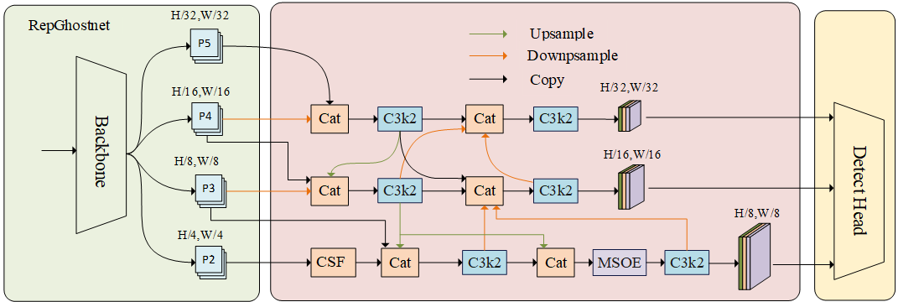

#  LMFF-Net: A Lightweight Multi-Scale Feature Fusion Network Towards Underwater Object Detection
Xiushuai Xu, Zhibin Xie, Qian Li, Xin Shu, Changbin Shao
## Abstract:
Underwater object detection technology holds significant application value in fields such as marine exploration and ecological monitoring. However, existing detection methods are often limited in accuracy due to complex underwater environments and object characteristics like small scales and weak textures. Meanwhile, existing models usually have a large number of parameters and are difficult to deploy on resource-constrained platforms. To address these challenges, we propose a lightweight multi-scale feature fusion network named LMFF-Net. Utilizing RepGhostNet as the feature extraction network and incorporating an enhanced bidirectional feature pyramid structure, the proposed LMFF-Net effectively reduces the number of parameters and computational cost while maintaining detection accuracy. In the feature pyramid, we design a multi-scale object enhancement (MSOE) module that synergistically combines spatial multi-scale convolutions with spatial-frequency attention mechanisms. This synergy enhances feature discriminability and improves small object representation. Furthermore, we construct a channelized spatial fusion (CSF) module to achieve lossless downs ampling of feature maps by leveraging the spatial-to-depth transformation principle, thereby maximizing the retention of fine-grained spatial information in deep networks. Experimental results on the DUO dataset show that LMFF-Net achieves an mAP@0.5 of 84.7% with only 1.73 M parameters, significantly outperforming other classic object detection models. Additionally, generalization experiments on the URPC2020 and RUOD datasets also demonstrate the excellent generalization ability of the proposed model.
## Overall Architecture Diagram of LMFF-Net

